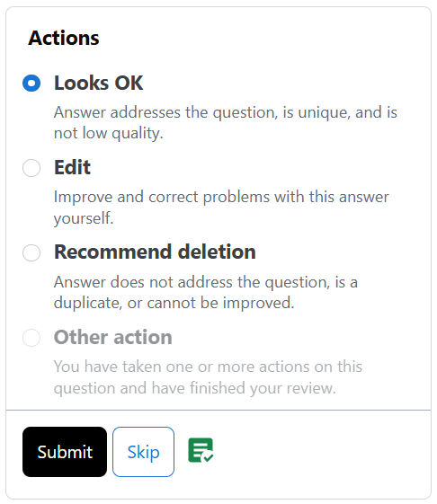
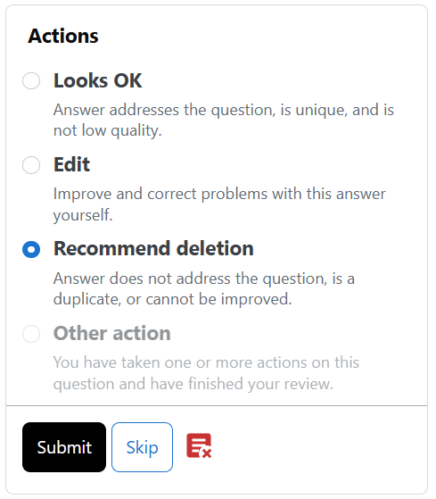

# SE Review Helper

Detect audits in [Stack Exchange review queues](https://meta.stackexchange.com/help/reviews-intro).

## Features

The extension will verify every review task as soon as the task is loaded.

If the incoming review is an audit:

- the <kbd>Submit</kbd> button will turn black
- if it's a **positive audit**[^1],
<kbd></kbd>
will be added beside the <kbd>Skip</kbd> button
- if it's a **negative audit**[^2],
<kbd></kbd>
will be added beside the <kbd>Skip</kbd> button

Screenshots:

 

## Installation

It's provided as a Web Extension. You can install it:

- from [Microsoft Edge Add-ons](https://microsoftedge.microsoft.com/addons/detail/pjbldmpcjjlofllkkoaceobegakffndb)
- from GitHub releases

## Security & Privacy

The extension does not send any data to any server except the Stack Exchange API.

The extension uses some internal APIs of Stack Exchange, which may change at any time. Use it at your own risk, though it's unlikely to cause any harm.

[^1]: Positive audits are the audits that you should click <kbd>Looks OK</kbd> or <kbd>Edit</kbd> for.

[^2]: Negative audits are the audits that you should **not** click <kbd>Looks OK</kbd> for.
